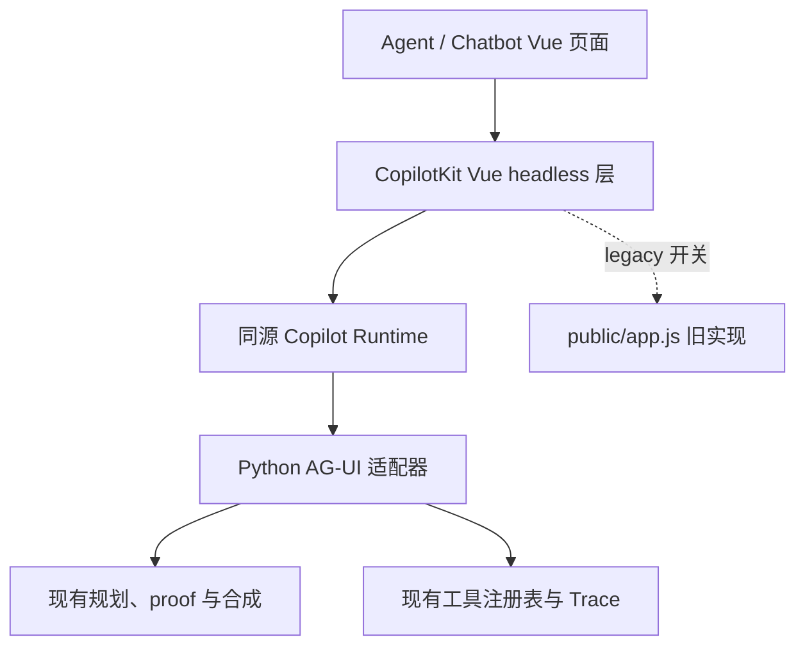

# Offer Intelligence M6：CopilotKit / AG-UI Agent 迁移方案

> 状态：已实施（生产 Agent 默认使用 CopilotKit Runtime；保留 legacy 紧急回退）
> 基线分支：`FRONTEND-VUE-MIGRATION`  
> 实施基线：`817d6d81566af0516d99da53de95f45193701928`（2026-09-04，包含 PR #184 最新 Agent/Chatbot 外观与 M6 Runtime 对齐）
> 调研日期：2026-09-02；实施更新：2026-09-04
> 建议仓库落点：`docs/superpowers/plans/2026-09-02-m6-copilotkit-agent-migration-plan.md`
> 当前落地状态（2026-09-04）：`@copilotkit/vue@1.70.0`、`@copilotkit/runtime@1.70.0`、`@ag-ui/client@0.0.59` 与 Python `ag-ui-protocol==0.1.22` 已接入；真实多路由端点为 `/api/copilotkit`，其默认 Agent 通过同部署 `/api/chat/agui` 回到 Python，本地 `server.py` 也暴露同一路由。Chatbot Report/Chat、Deep Window 与独立 Agent 均由 Modern Vue session 默认承载；生产启动配置默认启用 CopilotKit，`OI_AGENT_RUNTIME_MODE=legacy` 或显式 parity 开关可紧急回退。页面继续使用 PR #184 的 YeahPromos Vue 外观，不加载 CopilotKit Sidebar。

## 1. 结论

M6/01 已按“业务与安全核心不变、传输层替换”的方式完成。实际实施边界是：

1. 现有 Python registry、参数/结果白名单和 HMAC plan proof 继续作为唯一权威；
2. CopilotKit Runtime 只负责同源认证、AG-UI 转发、消息状态与 frontend tool continuation；
3. 浏览器继续执行现有 7 个只读数据工具，并回传与 Agent v2 相同的受限投影；
4. Python AG-UI 状态机管理 planning、每批最多 4 个工具、总预算 6、一次 replan、synthesis 与 stop；
5. Report/Chat、Deep Window 与独立 Agent 已默认切换到 Modern Vue session；Agent 的运行传输由 CopilotKit Runtime/AG-UI 接入，Legacy 仅作为显式回退窗口保留。

目标不是“用 CopilotKit 重写 Agent”，而是采用绞杀式迁移：

- **CopilotKit**：Vue 交互、消息/运行状态、工具调用生命周期、AG-UI 传输；
- **现有 Python Agent**：规划协议、工具注册表、plan proof、合成、Trace、问题日志、反馈与隐私边界；
- **YeahPromos Vue 组件**：保留当前视觉与交互，不直接换成 CopilotKit 默认皮肤；
- **legacy 实现**：在整个 M6 期间保留为按用户/环境可立即回滚的后备路径。

这条路径的核心理由：CopilotKit 已有正式 Vue 3 包和 AG-UI 运行时，但现有 Offer Intelligence Agent 不是普通聊天框，而是带服务端白名单、HMAC 计划证明、前端只读工具、两阶段合成、结构化记忆和脱敏 Trace 的受控数据 Agent。直接换成 BuiltInAgent 或默认 UI 会丢失这些安全和产品契约。

## 2. 调研基线与可信来源

| 来源 | 核对结果 | 在本方案中的用途 |
|---|---|---|
| [M0–M8 前端迁移路线图](https://github.com/Yeahpromos/offer-intelligence/blob/FRONTEND-VUE-MIGRATION/docs/superpowers/plans/2026-08-27-frontend-framework-migration-roadmap.md) | M0–M5 已验证，M6 Modern-first 运行时与页面切换已实施；M7 legacy 清理和 M8 部署切换仍保留为后续阶段 | 决定阶段顺序与退出门槛 |
| [`FRONTEND-VUE-MIGRATION` 分支](https://github.com/Yeahpromos/offer-intelligence/tree/FRONTEND-VUE-MIGRATION) | 当前基线为 M6 Modern-first 运行时；Vue 3.5、TypeScript、Vite、Vitest 已落地，`entry.ts` 已注册 Chatbot/Agent modern factory，Agent 通过按需 CopilotKit bundle 接入同源 Runtime/AG-UI | 决定文件结构与构建约束 |
| [Chatbot/Agent 功能报告](https://github.com/Yeahpromos/offer-intelligence/blob/FRONTEND-VUE-MIGRATION/docs/chatbot-feature-report.md) | Report/Chat 两模式、Agent v2、7 个只读工具、plan proof、Trace、记忆与停止语义均已有明确契约 | 决定不可回归项 |
| [线上 yeahpromo.asia](https://www.yeahpromo.asia/) | 登录后导航同时存在 Agent 与 Chatbot；Agent 有工作区、能力卡、示例、时间线、新会话和停止；Chatbot 有 Report/Chat、上下文、记忆区、引导与日志 | 决定页面与交互迁移清单 |
| [CopilotKit 仓库](https://github.com/CopilotKit/CopilotKit) / [v1.70.0](https://github.com/CopilotKit/CopilotKit/releases/tag/v1.70.0) | MIT；当前核对版本 `v1.70.0`；包含正式 Vue 包、Runtime 与 AG-UI 接入 | 决定目标依赖与能力边界 |
| [`@copilotkit/vue`](https://github.com/CopilotKit/CopilotKit/tree/main/packages/vue) | 支持 Vue 3.3+，提供 Provider、`CopilotChat`、`useAgent` 与可替换 slot | 决定采用 headless/slot，而非默认视觉替换 |
| [AG-UI](https://github.com/ag-ui-protocol/ag-ui) | 提供标准运行、文本、工具、状态和自定义事件；Python `ag-ui-protocol` 当前源码版本为 `0.1.22` | 决定适配协议 |
| 附件 `02-functional-catalog.md` | 关键词核对未覆盖 Agent/Chatbot/CopilotKit | 不作为本次功能边界的权威来源 |

本文结论基于公开线上页面抓取、GitHub 当前分支代码和官方 CopilotKit/AG-UI 源码；若实施时基线提交已变化，应先重跑第 13 节的契约核对。

## 3. 当前系统画像

### 3.1 前端与部署

- Vue 3.5.42、TypeScript 5.9.3、Vite 8.2.2、Vitest 4.1.11；`frontend` 运行时目前仅依赖 Vue。
- `frontend/src/entry.ts` 通过 `window.ModernApp` 注册现代页面；`dashboard` 与 `agent` 已出现在类型契约中，但未注册 modern factory。
- Vite 当前以 IIFE library 模式生成单一 `public/assets/modern/oi-modern.js`。IIFE 不适合直接加入体积较大的 AI 依赖并依赖动态分包。
- Vercel 同时运行静态前端、Node 构建和 Python API；Python function 当前最大时长 60 秒。
- 浏览器认证使用 HttpOnly `oi_session` Cookie；服务端用 `OI_SESSION_SECRET` 校验 HMAC 会话。

### 3.2 Report Mode

- `window.CHATBOT_DATA` 提供预载数据；浏览器执行搜索、分类回退、商家/品类/Tier 分析、比较和结果压缩。
- `/api/chat/classify` 负责 LLM 分类；失败时回退到规则引擎。
- 结果可进入 Report 上下文、记忆区、导出快照和 Deep Window。
- 具体数据结论必须来自可验证的数据源，模型文本不能代替数据事实。

### 3.3 Chat Mode 与独立 Agent

- 概念性问题可直接调用 `/api/chat/stream`。
- 数据问题先调用 `/api/chat/agent` 规划工具，浏览器执行工具，再把受 plan proof 约束的结果提交给 `/api/chat/stream` 合成。
- 7 个工具为：`merchant_analysis`、`category_analysis`、`merchant_comparison`、`tier_analysis`、`category_comparison`、`payment_status`、`trend`。
- 服务端 `agent_tool_registry.py` 是 schema、参数上限、结果字段/大小/来源上限的唯一权威。
- `agent_contract.py` 使用 `OI_SESSION_SECRET` 生成 HMAC plan proof；proof 绑定问题、调用和运行元数据，有效期 600 秒。
- 单轮最多 6 个调用、每批最多 4 个；最多一次结构化 replan。
- 独立 Agent 页面有单独历史、规划/工具/合成时间线、AbortController 停止和结构化本地记忆。
- 当前 proof 只证明运行与调用元数据，不能证明浏览器返回的数据值；这是现有已知信任边界，不在 UI 迁移中被扩大。

### 3.4 当前 SSE 与可观测性

当前流式协议是自定义 SSE：token 事件、可选 usage 事件、`[DONE]`、错误事件。Trace 对规划、工具与合成仅记录允许的指标和元数据；写入失败不得阻断回答，也不得记录 prompt、完整工具 JSON、答案正文或异常堆栈。

## 4. 方案选择

| 方案 | 结论 | 原因 |
|---|---|---|
| 用 CopilotKit BuiltInAgent 重写 Python Agent | 拒绝 | 会复制/替换现有注册表、proof、Trace、分类回退和数据来源校验，迁移面过大 |
| 浏览器直接连接 self-managed Agent | 不作为生产基线 | 官方当前把生产 self-managed agents 单列为生产配置；直接连接还会绕过统一 Runtime 鉴权，且需要单独确认授权/部署能力 |
| 直接使用 CopilotKit 默认聊天 UI | 拒绝 | 线上 Agent/Chatbot 有明确品牌、时间线、记忆和 Deep Window 交互；视觉和行为偏差不可控 |
| Vue headless/slot + Copilot Runtime + Python AG-UI 适配器 | **采用** | 能复用官方 Vue/运行状态与 AG-UI，同时保留业务、安全和数据契约 |
| M6/01 一次性切换 Agent 页面 | 拒绝 | 与既定 M6 阶段顺序冲突；缺少纯 model、协议和双栈验证 |

版本基线建议精确锁定：

- `@copilotkit/vue@1.70.0`
- `@copilotkit/runtime@1.70.0`
- `@ag-ui/client@0.0.59`（仅在 Runtime/自定义 transport 直接需要时显式安装）
- `ag-ui-protocol==0.1.22`

实施 PR 不应使用 `latest` 或宽泛 semver。升级版本应是独立 PR，并重跑协议、bundle 和视觉基线。

## 5. 目标架构



### 5.1 浏览器层

- `oi-modern.js` 继续注册所有 Vue 页面；进入独立 Agent 时才按需加载 `oi-agent-runtime.js` 并覆盖 `agent` factory，Chatbot 不加载 CopilotKit。
- 使用 `CopilotKitProvider` 与 `useAgent` 管理 thread、运行、消息、停止和状态订阅。
- 页面、消息、输入区、时间线、能力卡、记忆栏继续由 YeahPromos Vue 组件渲染。
- 如使用 `CopilotChat`，必须覆盖关键 slot；不得把官方默认 CSS 全局注入现有页面。
- 浏览器仍只把工具名称、参数与受控结果提交给服务端；任何浏览器 schema 或描述都不得成为规划权威。

### 5.2 Runtime 层

- 新增同源 `/api/copilotkit/*` Node serverless function，自托管 `@copilotkit/runtime`。
- Runtime 使用 `onRequest` 做认证门禁；不能依赖默认 header forwarding，因为默认不会转发 Cookie。
- Runtime 调用 Python AG-UI 适配器；浏览器不直接访问内部适配器。
- 采用两阶段 continuation：规划/工具阶段与合成阶段是两个短运行，共用 `agentRunId` 和 thread，避免把原来两个最多 60 秒的请求强行合并成一个可能超时的函数。

### 5.3 Python AG-UI 适配层

- 解析 `RunAgentInput`，只提取白名单消息、thread/run id 和允许的状态字段。
- 继续调用现有规划、proof 校验、合成和 Trace 模块，不复制业务判断。
- 把现有生命周期翻译成 AG-UI 事件；自定义事件统一以 `oi.*` 命名。
- 第一阶段保留浏览器工具执行，以维持完全相同的数据与结果；服务端继续用 canonical registry 和 plan proof 校验。
- 后续安全加固可把 7 个只读工具移到 Python `AgentToolExecutor`，但必须先用相同 fixture 对 browser/server 结果做逐字段双跑比较。这是独立优化，不阻塞 UI 迁移。

### 5.4 认证路径

生产推荐配置专用密钥 `OI_COPILOT_INTERNAL_TOKEN`；为延续现有密钥接口，未配置时使用 `OI_SESSION_SECRET`：

1. 浏览器以同源 Cookie 请求 Copilot Runtime；
2. Runtime `onRequest` 使用 `OI_SESSION_SECRET` 在本地校验现有 `oi_session` 的 HMAC、角色与过期时间；
3. 通过后，Runtime 仅用服务端持有的 internal token 调用 Python AG-UI 适配器；
4. Python 使用常量时间比较验证 token，并只接收最小身份上下文；
5. 原 Cookie 不进入 Agent payload、Trace 或日志。

如配置 `OI_AGENT_AGUI_URL`，Runtime 只使用该显式内部 URL；否则在 Vercel 使用受平台提供的 `VERCEL_URL` 生成同部署 `/api/chat/agui` 地址，本地开发才回退到经过格式校验的请求 host。Cookie、Authorization 与任意 `x-*` 浏览器头均不转发给 Python。

## 6. 协议映射

| 现有语义 | AG-UI/适配事件 | UI 行为 | Trace 行为 |
|---|---|---|---|
| 开始一轮 | `RUN_STARTED` | 锁定输入，显示运行中 | 新建 run，记录版本与计数 |
| 规划开始/结束 | `STEP_STARTED` / `STEP_FINISHED`，step=`planning` | 时间线展示“分析问题/生成计划” | 仅记录耗时、轮次、调用数 |
| 计划工具 | `TOOL_CALL_START` → `TOOL_CALL_ARGS` → `TOOL_CALL_END` | 展示工具名与安全摘要 | 保存 call id、名称、状态，不存完整参数 |
| 浏览器工具结果 | 标准 tool result/message；必要时补 `oi.tool.result_meta` | 展示来源、as-of、estimated、partial | 记录大小、来源数、校验状态，不存正文 |
| replan | 新 planning step + `oi.replan` | 时间线新增一轮，不伪装成内部思考 | 累加 replan 计数，最多一次 |
| 合成文本 | `TEXT_MESSAGE_START` → `TEXT_MESSAGE_CONTENT` → `TEXT_MESSAGE_END` | 流式 Markdown、跟随滚动 | 仅 token/耗时/usage，不存答案正文 |
| usage | `oi.usage` | 可选调试/费用 UI | 白名单计数 |
| partial/omitted | `oi.partial` | 明确显示部分结果与遗漏项 | 记录布尔值和数量 |
| 成功 | `RUN_FINISHED` | 提交正式历史与安全记忆 | run=`completed` |
| 用户停止 | `oi.run.stopped` 后终止 transport | 保留已显示临时文本，不提交本轮用户消息到正式历史 | run=`stopped_by_user` |
| 可控失败 | `RUN_ERROR`，仅安全错误码 | 可重试/回退 legacy | run=`failed`；不存堆栈 |

停止语义必须通过适配器测试确定：`abortRun()` 触发底层 AbortSignal，Python provider 调用被取消或忽略后续输出，未完成轮次不进入正式历史。不得把“用户停止”统计为模型错误。

## 7. 迁移内容清单

### 7.1 必须迁移

| 现有能力 | 目标位置 | 阶段 |
|---|---|---|
| 搜索、分类回退、商家/品类/Tier 分析与结果压缩 | `frontend/src/features/chatbot/model/` | M6/01 |
| 分析表格、比较卡、来源/时间/估算标记 | `frontend/src/features/chatbot/components/results/` | M6/01–02 |
| Report Mode 路由、上下文、记忆、导出快照 | `frontend/src/features/chatbot/report/` | M6/02 |
| Chat Mode 消息、SSE/AG-UI 流、停止、反馈 | `frontend/src/features/chatbot/chat/` | M6/03 |
| Deep Window 生命周期与图表克隆 | `frontend/src/features/chatbot/deep-window/` | M6/04 |
| 独立 Agent 页面、thread、时间线、工作区、能力卡 | `frontend/src/features/agent/` | M6/05 |
| 安全结构化记忆 | `frontend/src/features/agent/memory/` | M6/05 |
| onboarding、help guide、问题日志、负反馈 | Vue feature + 现有 Python API | M6/06 |
| 运行时鉴权、AG-UI 适配、协议 reducer | `copilotkit_runtime.mjs` + `agent_agui.py` + Vue runtime | M6/01 起贯穿 |

### 7.2 保留并复用

- `agent_tool_registry.py`：唯一工具 schema/限制来源；
- `agent_contract.py`：proof 生成、TTL、绑定与结果校验；
- `chat_agent_http.py`：provider 与计划/合成安全边界；
- 现有 DB/数据 API 与数据来源标记；
- Agent Trace、question log、negative feedback 后端；
- `OI_AGENT_ENABLED` 总开关；
- 现有登录、会话 Cookie 和登出清理语义；
- legacy 页面与节点测试，直到 M6 完整退出。

### 7.3 不迁移或不采纳

- 不迁移 raw chain-of-thought；时间线只显示产品化阶段摘要；
- 不把 prompt、答案正文、完整工具参数/结果或异常堆栈写入 Trace；
- 不把 CopilotKit 的 client tool schema 当作服务端权威；
- 不将 Agent 历史与 Chatbot Report/Chat 历史合并；
- 不默认启用 CopilotKit 云端服务或 Enterprise 功能；
- 不在 M6/01 删除 legacy DOM、全局函数或 `public/app.js` 分支。

## 8. M6 分阶段实施

### M6/01：CopilotKit/AG-UI 生产基础（已完成）

目标：在不改变业务权威与 YeahPromos 外观的前提下，将生产独立 Agent 默认传输切换到 CopilotKit Runtime。

交付物：

1. 契约快照与 fixture；
2. 无 DOM 的 TypeScript 搜索/分类路由/分析/压缩 model；
3. Vue 结果 View；
4. 独立 AI bundle；
5. Copilot Runtime 与 Python AG-UI 最小连通；
6. AG-UI event reducer、停止与错误 fixture；
7. 服务端 `copilotkit|legacy` 开关，默认 `copilotkit`；
8. Runtime 认证、真实 Node→Python SSE、AG-UI 批次和 proof-bound synthesis 回归测试。

明确不包含：Report/Chatbot/Deep Window 替换、删除旧代码、把浏览器数据工具迁到 Node、把 CopilotKit client schema 变成权威。

退出门槛：Node Runtime 与 Python AG-UI 协议测试、Python 契约测试、Vue 全量 Vitest、typecheck 和 production build 全部通过；`OI_AGENT_RUNTIME_MODE=legacy` 可恢复旧 session bridge。

### M6/02：Report Mode（已完成）

- 迁移 mode 路由、分类回退、分析卡/表、上下文、记忆拖放与导出快照；
- 对每种意图保留一份 legacy DOM snapshot 和结构化结果 fixture；
- LLM 分类失败、超时、未知 intent 必须走原规则路径；
- Report 结果不经过 CopilotKit 模型重新解释后再作为事实展示。

### M6/03：Chat Mode（已完成）

- 迁移 Markdown、流式增量、滚动锁、停止、重试、usage、`[DONE]`/fallback 和反馈；
- 把 direct chat 与 data-agent 路由保持为两个明确分支；
- 失败或停止的用户消息不写入正式历史；
- 先以 AG-UI 适配旧 SSE，再决定是否删除 `frontend/src/shared/stream/sse.ts` 的兼容路径。

### M6/04：Deep Window（已完成）

- 迁移最小化/恢复、跨模式上下文、图表克隆、焦点和页面清理；
- 路由切换和登出必须清理 observer、listener、AbortController 和 detached chart；
- 任何 Deep Window 状态不得意外进入 Agent 独立 thread。

### M6/05：独立 Agent 页面切换（已完成）

- 注册 `agent` modern factory；
- 迁移新会话、示例 prompt、能力卡、工作区、规划/工具/合成时间线、部分结果、停止；
- 迁移安全结构化记忆及 TTL/版本/长度/登出清理；
- `dual` 模式记录结构化 parity 指标，不记录用户问题或答案；
- 先内部用户、再小比例、再默认 modern；任一红线触发即时回 legacy。

### M6/06：辅助能力与清理（M6 部分已完成；legacy 删除留至 M7）

- onboarding、help guide、active state、缓存、问题日志、负反馈；
- 更新 `docs/chatbot-feature-report.md`、inventory、生成物说明和文件索引；
- 所有退出门槛通过后，分 PR 删除 `public/app.js` 中 Q&A、工具、分析、流式和 Agent DOM；
- 删除时保留 server contract tests，防止现代 UI 之后弱化服务端校验。

## 9. M6/01 文件级实施计划

### 9.1 PR 1：契约冻结（无运行时变化）

新增：

- `tests/fixtures/chatbot/intents/*.json`
- `tests/fixtures/chatbot/analysis/*.json`
- `tests/fixtures/agent/plans/*.json`
- `tests/fixtures/agent/agui-events/*.jsonl`
- `scripts/snapshot_chatbot_contract.mjs`
- `scripts/test_agent_agui_contract.py`

修改：

- `docs/chatbot-feature-report.md`
- `docs/frontend-migration-inventory.md`
- `docs/generated-file-index.md`

要求：fixture 去标识化；不得包含生产 prompt、答案、token、Cookie、proof 或真实敏感数据。

### 9.2 PR 2：纯 TypeScript model 与结果 View

新增：

- `frontend/src/features/chatbot/model/types.ts`
- `frontend/src/features/chatbot/model/search.ts`
- `frontend/src/features/chatbot/model/classification.ts`
- `frontend/src/features/chatbot/model/merchant-analysis.ts`
- `frontend/src/features/chatbot/model/category-analysis.ts`
- `frontend/src/features/chatbot/model/tier-analysis.ts`
- `frontend/src/features/chatbot/model/comparison.ts`
- `frontend/src/features/chatbot/model/result-compression.ts`
- `frontend/src/features/chatbot/components/results/AnalysisTable.vue`
- `frontend/src/features/chatbot/components/results/ComparisonCards.vue`
- `frontend/src/features/chatbot/components/results/SourceMeta.vue`
- 对应 Vitest 文件

要求：

- model 输入输出为可序列化类型，不读 DOM、`window`、localStorage 或网络；
- 排序、空值、四舍五入、月份、时区、estimated/partial/as-of 与 legacy 完全一致；
- 分类器返回 typed intent；LLM 失败路径由调用层明确回退规则模型；
- legacy 与 TS 结果对同一 fixture 做逐字段 compare。

### 9.3 PR 3：独立 Agent Runtime bundle（已实施）

新增/修改：

- `frontend/src/copilotkit-entry.ts`
- `frontend/vite.copilotkit.config.ts`
- `frontend/package.json`
- `public/auth.js` 或现有资源加载器
- `frontend/src/legacy/contracts.ts`

输出：

- `public/assets/modern/oi-agent-runtime.js`

原则：

- 保持现有 `oi-modern.js` 不含 CopilotKit；
- 仅在首次进入独立 Agent 时加载 Runtime bundle；
- bundle 加载失败自动保留/切回 legacy，并显示安全的可重试提示；
- AI gzip 预算初始上限 250 KB；若超限必须给出依赖构成和批准后的新预算，不得静默放宽。

### 9.4 PR 4：Runtime 与 AG-UI 适配骨架（已实施）

新增：

- 根 `package.json` 与锁文件（用于 Node Runtime，不替代 `frontend/package.json`）
- `copilotkit_runtime.mjs`
- `api/copilotkit/[...path].js`
- `agent_agui.py`
- `api/chat/actions.py` 中受可信路由头保护的 `agui` 分支
- `frontend/src/features/agent/CopilotKitAgentHost.vue`
- `frontend/src/features/agent/CopilotKitAgentRuntime.vue`

修改：

- `pyproject.toml`
- `requirements.txt`
- `uv.lock`
- `vercel.json`
- 本地启动文档/脚本

要求：

- 根安装与 frontend 安装都在 CI/Vercel 可复现；
- `/api/copilotkit/*` 与 Python endpoint 受认证保护；
- 规划与合成保持两阶段 continuation，不超过当前 function budget；
- AG-UI adapter 调用共享业务模块，不通过 HTTP 回调自己公开 endpoint；
- 未知 event/state 字段忽略或拒绝策略明确，payload 有大小限制。

### 9.5 PR 5：Vue headless Agent shell（已默认上线）

新增：

- `frontend/src/features/agent/AgentPage.vue`
- `frontend/src/features/agent/CopilotKitAgentHost.vue`
- `frontend/src/features/agent/CopilotKitAgentRuntime.vue`
- `frontend/src/features/agent/AgentTimeline.vue`
- `frontend/src/features/agent/AgentResultView.vue`
- `frontend/src/features/agent/agentResultRegistry.ts`
- `frontend/src/features/agent/agentRunReducer.ts`

修改：

- `frontend/src/copilotkit-entry.ts` 注册 `agent` factory；
- `frontend/src/entry.ts`/bridge 允许按需发现 AI factory；
- `public/app.js` 只增加受控委托与 fallback，不删除旧实现。

开关：

- `OI_AGENT_RUNTIME_MODE=copilotkit|legacy`，默认 `copilotkit`；
- `legacy` 通过已有 session bridge 执行，不产生双回答；
- `OI_AGENT_ENABLED=0` 时两种 runtime mode 都不得绕过总开关。

### 9.6 PR 6：Sites / 浏览器证据与退出

在现有 “Offer Intelligence Visual QA” Site 增加固定状态，而不是新建另一个 QA Site：

- `m6/agent?view=legacy`
- `m6/agent?view=modern`
- `m6/agent?view=compare`
- planning、tool batch、partial、synthesis、stopped、error、empty、long-content；
- desktop 与 mobile；英文与中文。

证据应记录 commit SHA、fixture id、viewport、截图链接和通过/失败，不得使用实时生产数据作为唯一证据。

## 10. M6/01 验收门槛

### 10.1 行为契约

- [ ] 所有 legacy/TS model fixture 逐字段相等；允许差异必须有显式白名单和理由。
- [ ] LLM 分类失败、超时、无效 JSON 继续命中原规则路径。
- [ ] 7 个工具名、参数限制、最大调用数、batch、replan、registry version 不变。
- [ ] plan proof 的问题/调用/run 绑定、600 秒 TTL、篡改/过期拒绝不变。
- [ ] tool result 白名单、大小、来源、call id 与 proof 绑定继续由服务端执行。
- [ ] Report/Chat、独立 Agent、Deep Window 的历史和上下文边界未合并。

### 10.2 流式与生命周期

- [ ] run/text/tool/step 事件顺序由 JSONL golden fixture 验证。
- [ ] malformed SSE、分块 JSON、重复 DONE、断线、超时和 provider error 有确定结果。
- [ ] Stop 在 250 ms 内进入本地 stopped 状态，不再渲染后续 token。
- [ ] 停止/失败轮次不写正式历史和结构化记忆。
- [ ] retry 生成新 run id，不复用旧 proof。
- [ ] 规划和合成分别保持在 60 秒 function budget 内。

### 10.3 安全、隐私与数据可信度

- [ ] 未登录访问 Runtime、AG-UI endpoint 和旧 Agent endpoint 均为 401/403。
- [ ] Runtime 不把 Cookie、internal token、prompt 或答案写日志。
- [ ] 浏览器提供的 schema/description 不能改变 canonical registry。
- [ ] Trace allowlist 测试证明不含 prompt、答案、完整 args/results、异常堆栈。
- [ ] 具体业务数字均带可验证来源；模型无来源文本不能成为事实结果。
- [ ] memory 只含既定安全字段，TTL 7 天，版本/长度校验与 logout 清理通过。

### 10.4 构建与体验

- [ ] `npm ci`、`npm --prefix frontend ci` 可从空缓存复现。
- [ ] TypeScript、Vitest、Node contract tests、Python tests 全绿。
- [ ] Vercel 路由与构建输出测试覆盖 Node/Python 混合 function。
- [x] `oi-modern.js` 不含 CopilotKit；`oi-agent-runtime.js` 只在 Agent 页面按需加载。
- [ ] Agent/Chatbot 首次进入、路由切换、登出、网络失败均无白屏。
- [ ] Sites legacy/modern/compare 的固定状态通过人工视觉复核。

建议 CI 顺序：

```text
contract fixtures
→ Python Agent/Trace tests
→ frontend typecheck + Vitest
→ Node Chatbot/Agent tests
→ two-package clean install + build
→ Vercel route/output tests
→ browser E2E
→ Sites fixed-fixture visual QA
```

## 11. 状态、历史与记忆设计

必须区分四类状态：

| 状态 | 所有者 | 可持久化 | 内容 |
|---|---|---|---|
| Copilot run state | `useAgent`/AG-UI | 仅 thread 需要 | messages、isRunning、tool lifecycle、safe UI state |
| Agent 正式历史 | Agent feature | 成功轮次 | 用户消息、显示答案；遵循现有边界 |
| Agent 安全记忆 | `agent_memory_state` 的 TS 等价实现 | localStorage，7 天 | focus、范围、metric、最近工具、来源/partial 元信息 |
| Report/Chat 上下文 | Chatbot feature | 按现有规则 | 报告卡、导出快照、Deep Window 上下文 |

AG-UI state snapshot/delta 只承载 UI 需要的安全字段；不能把完整 tool result、报告数据或模型正文塞入共享 state。thread id、run id 和 `agentRunId` 要有明确映射，并在新会话/登出时同时清理。

## 12. 发布、观测与回滚

### 12.1 发布梯度

1. 生产默认 `copilotkit`：只在进入 Agent 时加载 Runtime bundle；通过认证后的 `/info` 与 run smoke test 后放量。
2. 紧急 `legacy`：设置 `OI_AGENT_RUNTIME_MODE=legacy` 即恢复旧 session bridge，不需要重新构建前端。
3. 观察完成率、停止率、失败率、首 token、总耗时、partial 率和 fallback 率。
4. Chatbot Report/Chat 与 Deep Window 已随 Modern-first 切换完成；后续只做真实生产验收、稳定窗口和 M7 legacy 清理，不再把 Chatbot 迁移当作未开始项。
5. 稳定窗口后才删除 legacy。

### 12.2 红线与自动/人工回滚

任一条件触发立即把 `OI_AGENT_RUNTIME_MODE` 改回 `legacy`：

- 未授权请求能到达 agent adapter；
- canonical registry/proof/result binding 被绕过；
- Trace 出现受禁字段；
- 数据数字无来源或 legacy/modern 关键结果不一致；
- stop 后仍持续写历史/记忆；
- 5xx、超时或空白页相对 legacy 明显上升；
- bundle 加载使非 AI 页面性能回归。

回滚不得要求重新部署前端。总开关和 UI mode 应由服务端 bootstrap/session 响应提供，并有短缓存或无缓存策略。旧 endpoints、DOM 和测试至少保留到 M6/06 退出。

### 12.3 观测指标

只记录聚合或白名单元数据：

- run 完成、失败、停止、fallback；
- planning、tool、synthesis 耗时；
- tool 名称、调用数、batch/replan 数；
- first-token、总时长、usage；
- partial/omitted/source-count；
- legacy/modern 结构化 parity 结果；
- Runtime、AG-UI adapter、provider 的安全错误码。

不得记录 prompt、答案正文、完整 args/results、Cookie、token、proof 或堆栈。

## 13. 实施前必须完成的 P0 spike

这些是技术验证，不是重新讨论产品方向：

1. **Vue 包形态**：验证 `@copilotkit/vue@1.70.0` 在当前 IIFE/独立 AI build 中可运行；若不行，AI bundle 改为单独 ESM，由 loader 按需加载，不能改坏现有 `oi-modern.js`。
2. **Vercel Runtime adapter**：已使用 `api/copilotkit/[...path].js` multi-route handler 与 `vercel.json` 规则；部署后仍需 smoke test 验证 `/info` 和 run endpoint。
3. **两阶段 continuation**：证明 plan → 浏览器工具 → synth 会形成两个短请求，并保留一个产品 `agentRunId`；不得把最坏 30s + 50s 合并进单个 60s function。
4. **客户端工具 schema**：若 CopilotKit frontend tool API 必须发送 schema，服务端必须忽略它，只接受 enabled name，并用 canonical registry 生成真实 schema。若无法保证，使用 `useAgent` + 自定义 continuation bridge。
5. **Cookie 鉴权**：验证 Runtime 的 `onRequest`、session introspection 和 internal token 路径；默认 header forwarding 不视为已鉴权。
6. **Stop**：验证 `abortRun()` 对 Node Runtime、Python provider 和旧 SSE 的传播；以“无后续 UI token、无正式历史、Trace stopped”为通过标准。

任何 spike 失败都只改变适配实现，不改变“保留现有 Agent 领域契约”的总体决定。

## 14. 完整 M6 退出标准

M6 只有在以下条件同时满足时才结束：

- Chatbot Report/Chat、Deep Window、独立 Agent、引导/帮助/反馈全部由 Vue 实现；
- CopilotKit/AG-UI 路径保留现有分类回退、数据来源、工具注册表、proof、Trace、停止和隐私语义；
- Node/Python/Vitest/浏览器/Sites 视觉测试全绿；
- `public/app.js` 的相关实现已不再作为默认渲染路径；旧 Q&A、分析、工具执行、流式和 Agent DOM 继续作为 M7 删除范围；
- legacy fallback 经过稳定窗口后按独立 M7 PR 删除，不阻塞 M6 Modern-first 放行；
- `docs/chatbot-feature-report.md`、迁移 inventory、生成物与文件索引是当前权威；
- 依赖版本、运行时 URL、密钥、开关、部署与回滚都有运维文档。

## 15. 推荐执行顺序

M6 Modern-first Runtime 与页面切换已完成：Report/Chat、Deep Window 和独立 Agent 均通过独立 Vue session 承载，Agent 默认按需加载 CopilotKit 并经 `/api/copilotkit` → `/api/chat/agui` 进入 Python registry/proof。此次补齐本地 AG-UI 路由、显式 Legacy Agent session 适配、Chat answer ID/逐回答反馈/Open as View、Deep Window 趋势控件和关键词候选预筛回归。下一步只需在真实 Vercel 环境验证 `/api/copilotkit/info`、`/api/copilotkit/agent/default/run`、内部鉴权、停止与一次 replan，并在稳定窗口后按独立 PR 删除 legacy；`test_chatbot_intent_flow.mjs` 已稳定通过。

## 16. 主要参考链接

- [Offer Intelligence M0–M8 路线图](https://github.com/Yeahpromos/offer-intelligence/blob/FRONTEND-VUE-MIGRATION/docs/superpowers/plans/2026-08-27-frontend-framework-migration-roadmap.md)
- [Offer Intelligence Chatbot/Agent 功能报告](https://github.com/Yeahpromos/offer-intelligence/blob/FRONTEND-VUE-MIGRATION/docs/chatbot-feature-report.md)
- [Offer Intelligence 迁移分支](https://github.com/Yeahpromos/offer-intelligence/tree/FRONTEND-VUE-MIGRATION)
- [YeahPromos 线上站点](https://www.yeahpromo.asia/)
- [CopilotKit](https://github.com/CopilotKit/CopilotKit)
- [CopilotKit Vue 包](https://github.com/CopilotKit/CopilotKit/tree/main/packages/vue)
- [CopilotKit Vue 文档](https://docs.copilotkit.ai/vue)
- [CopilotKit Runtime](https://github.com/CopilotKit/CopilotKit/tree/main/packages/runtime)
- [CopilotKit self-managed agents 文档](https://docs.copilotkit.ai/backend/self-managed-agents)
- [AG-UI 协议与 SDK](https://github.com/ag-ui-protocol/ag-ui)
- [AG-UI Python SDK](https://github.com/ag-ui-protocol/ag-ui/tree/main/sdks/python)
